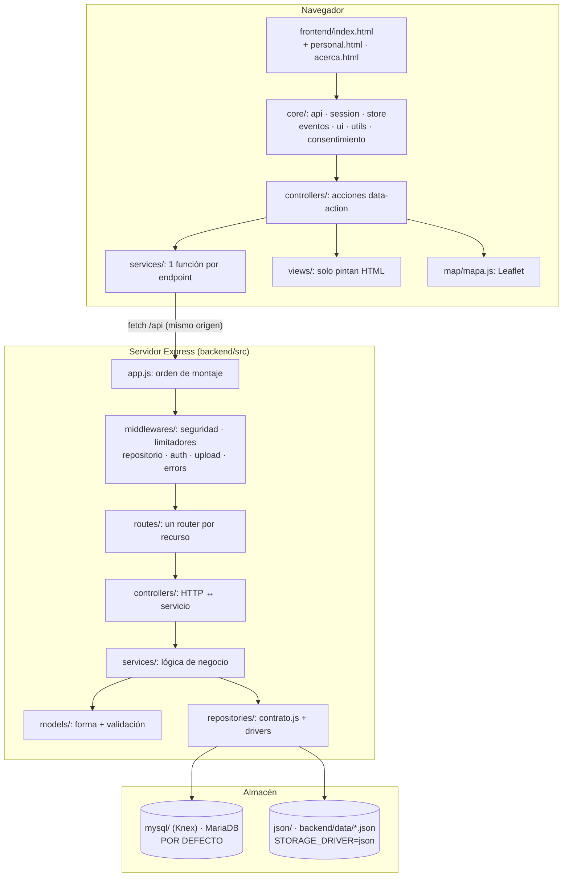
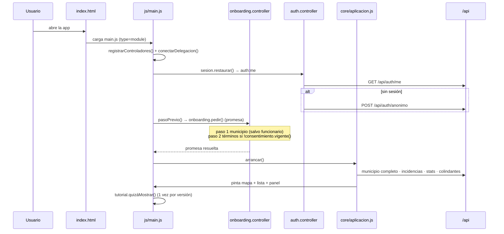
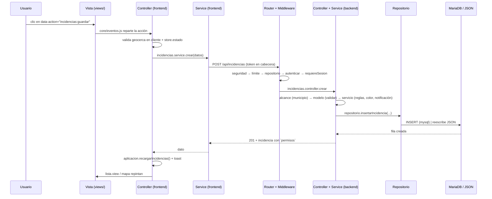
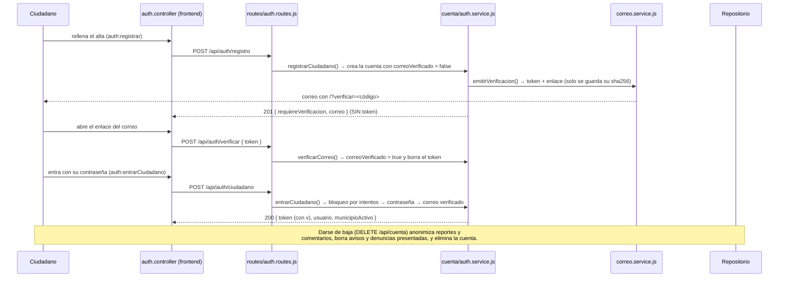

# Esquema funcional del sistema de incidencias

Mapa de «qué archivo controla qué». Pensado para orientarse rápido antes de tocar código.
Complementa al `README.md` (que explica el *cómo se usa*) con el *quién hace qué*.

---

## 1. Vista general (capas)



**Regla de oro del frontend:** no hay `onclick`. Todo elemento declara
`data-action="dominio:accion"` (o `data-change`/`data-input`/`data-submit`), `core/eventos.js`
hace la delegación sobre `document` y el controlador registra el manejador con
`registrarAcciones({ 'dominio:accion': (ctx) => … })`. El contexto es
`{ evento, elemento, id, valor }`.

**Regla de oro del backend:** el controlador nunca lleva lógica de negocio; los servicios
nunca hablan HTTP; los repositorios son los únicos que saben si el almacén es MySQL o JSON.

---

## 2. Arranque (quién manda en cada paso)



Puntos clave:

- `pasoPrevio()` se engancha con el gancho `antesDeArrancar` de `entrar()` en
  `auth.controller.js` (lo usan `main.js` y `entrarComoCiudadano`).
- Si el `auth:me` inicial devuelve **403** (cuenta suspendida) **no** se entra como
  anónimo: se pinta `bloqueo.view.js` a pantalla completa.
- `verificar/` `personal.html` (`/personal`) es la única puerta del personal; guarda sesión y
  hace `location.replace('/')`.

---

## 3. Backend: archivo → responsabilidad

### 3.1 Núcleo

| Archivo | Qué controla |
|---|---|
| `backend/src/server.js` | Arranque real: valida `problemasDeConfiguracion()`, crea la app, escucha y cierra con SIGTERM. |
| `backend/src/app.js` | **Orden de montaje**: cabeceras de seguridad → parser JSON (1 MB global, 100 MB solo en `/api/admin/importar`) → `inyectarRepositorio` → `autenticar` → `/api` → `/uploads` → frontend estático → `app.get('*')` → `manejarErrores`. |
| `backend/src/config/index.js` | Config central: puerto, driver (`STORAGE_DRIVER`, por defecto `mysql`), rutas, límites, bloques `seguridad` / `evidencia` / `correo` (SMTP y URL pública) / `cuenta` (verificación, caducidades, intentos), `problemasDeConfiguracion()` y `avisosDeConfiguracion()`. |
| `backend/src/config/constantes.js` | **Las reglas del dominio en un sitio**: `ROLES`, `ROLES_EMPLEADO`, `ESTADOS`, `COLORES`, `DIAS_LIMITES`, `TIPOS_NOTIFICACION`, `MOTIVOS_DENUNCIA`, `ADVERTENCIAS_MAX`, `MUNICIPIO_DEFAULT`, `TIPO_OTRO`, `EVIDENCIA_POLITICA` (límites, lista cerrada de mimes y extensiones), `COLECCIONES`. |
| `backend/src/config/semilla.js` + `seed-data/` | Datos semilla (municipios, zonas, tipos). **Generados** por los scripts: no editar a mano. |

### 3.2 Middlewares (el turno de cada petición)

| Archivo | Qué controla |
|---|---|
| `middlewares/repositorio.js` | Inyecta `req.repositorio` según el driver (todos lo usan). |
| `middlewares/auth.js` | `autenticar` (**async**: corta con 403 si la cuenta está suspendida y con 401 si el token es de una versión de sesión anterior), `requiereSesion`, `requiereEmpleado`, `requiereAdmin`, `esEmpleado`. Aquí vive la autorización por rol. |
| `middlewares/seguridad.js` | CSP propia por entorno, `Permissions-Policy` (geolocation), cabeceras restrictivas de `/uploads`, `ASUMIR_HTTPS`. |
| `middlewares/limitadores.js` | `crearLimitador({max, porCuenta, saltarExitosas})`: clave `userKey` o IP. Se apaga con `NODE_ENV=test`. |
| `middlewares/upload.js` | Multer: tamaño por archivo (`maxFotoBytes`), mime permitido (lista cerrada) y nombre aleatorio con la extensión del **tipo permitido** (nunca la del nombre que envía el cliente). El tope del conjunto de la carga se aplica al terminar, en `validarArchivos`. |
| `middlewares/errors.js` | `rutaNoEncontrada` y `manejarErrores` (honra `err.status`, registra siempre los 5xx). |

### 3.3 Rutas → controladores → servicios

`routes/index.js` monta todo bajo `/api` y deja `/salud` **antes** del límite general.

| Router | Rutas principales | Controlador | Servicio(s) |
|---|---|---|---|
| `routes/auth.routes.js` | `POST /anonimo`, `/registro`, `/ciudadano`, `/funcionario`, `/admin`, `/verificar`, `/reenviar`, `/olvide`, `/restablecer`; `GET /me`; `POST /municipio-activo` | `auth.controller.js`, `cuenta.controller.js` | `auth.service.js`, `cuenta.service.js`, `sesion.service.js`, `correo.service.js` |
| `routes/cuenta.routes.js` | Con sesión: `POST /cuenta/password`, `/cuenta/correo/reenviar`; `GET /cuenta/datos`; `DELETE /cuenta` | `cuenta.controller.js` | `cuenta.service.js` |
| `routes/catalogos.routes.js` | `/catalogos`, `/municipios`, `/municipios/:id(/zonas)(/colindantes)`, `/tipos`, `/usuarios` | `municipios.controller.js`, `tipos.controller.js`, `usuarios.controller.js` | `municipios.service.js`, `geocerca.service.js`, `colindantes.service.js`, `tipos.service.js`, `usuarios.service.js` |
| `routes/incidencias.routes.js` | CRUD `/incidencias`, `/estado`, `/peligro`, `/resolucion`, `/comentarios`, `POST /uploads` | `incidencias.controller.js`, `uploads.controller.js` | `incidencias.service.js`, `alcance.service.js`, `uploads.service.js`, `notificaciones.service.js` |
| `routes/moderacion.routes.js` | `/denuncias`, `/moderacion/denuncias`, `/moderacion/incidencias/:id/ocultar`, `/moderacion/cuentas/...` | `moderacion.controller.js` | `moderacion.service.js` |
| `routes/notificaciones.routes.js` | `/notificaciones` (+ marcar/leída/borrar) | `notificaciones.controller.js` | `notificaciones.service.js` |
| `routes/reportes.routes.js` | `/stats/panel`, `/stats/informes`, `/exportacion`, `/admin/limpiar`, `/admin/importar` | `stats.controller.js`, `admin.controller.js` | `stats.service.js`, `importacion.service.js` |
| `routes/index.js` | `GET /salud` (ping real al almacén → 503 si falla) | — | — |

### 3.4 Servicios (la lógica de negocio, por tema)

| Servicio | Qué decide |
|---|---|
| `alcance.service.js` | **Quién ve y quién manda en qué municipio**: `filtrosDeAlcance`, `puedeElegirMunicipio`, `fueraDeSuMunicipio`, `puedeSancionarA`, jerarquía de sanciones. |
| `geocerca.service.js` | Punto-en-polígono, `anillosDe()` (multipolígonos), validación de ubicación por municipio/zona. |
| `incidencias.service.js` | Ciclo de vida del reporte: crear, editar, cambiar estado, resolver, comentar, `permisosDe()`, `marcarPeligro()`, `contarPeligrosas()`, `conComentariosVisibles`. |
| `estado.service.js` | Color por antigüedad (`DIAS_LIMITES`), estados, prioridad, `contarPeligrosas()`. |
| `auth.service.js` | Login anónimo/ciudadano/funcionario/admin, registro (con correo de confirmación y **sin sesión** hasta que se abra el enlace), hash bcrypt, rechazo de cuentas suspendidas y de correos sin verificar, bloqueo temporal por intentos fallidos. |
| `sesion.service.js` | Construye la sesión: token firmado (con `v`, la versión de sesión) y contexto público del usuario. Vive aparte para que la cuenta pueda devolver un token nuevo sin crear un ciclo de imports. |
| `cuenta.service.js` | Ciclo de vida de la cuenta: emitir/verificar el correo, reenviar, recuperar y cambiar la contraseña, **exportar los datos** y **dar de baja** (anonimiza reportes y comentarios, borra avisos y denuncias presentadas). |
| `correo.service.js` | Envío de correo: SMTP con `nodemailer` si hay `SMTP_HOST`, y si no escribe el mensaje en el registro. En `NODE_ENV=test` además lo deja en una **bandeja en memoria** que leen las pruebas. Nunca lanza hacia arriba. |
| `usuarios.service.js` | Alta/edición de cuentas del **personal** (solo admin); no toca campos de sanción. |
| `notificaciones.service.js` | Buzón: `destinatarioDeIncidencia()` (null para `anon_*`), listar (vacío para anónimo), acuses, alertas globales. |
| `moderacion.service.js` | Denuncias, `resolver`, ocultar incidencia/comentario, advertir, suspender/reactivar (`ADVERTENCIAS_MAX = 3`). |
| `stats.service.js` | Panel admin, informes, exportación (esta **sí** incluye las ocultas: es el respaldo). |
| `municipios.service.js` | Catálogo ligero (sin polígonos) y detalle con contorno. |
| `colindantes.service.js` | Vecinos por distancia mínima entre fronteras (< ~100 m), con rejilla + memorización. |
| `tipos.service.js` | Catálogo de conceptos (18-20 tipos), aviso por tipo, alta/baja de personalizados. |
| `uploads.service.js` | Guardado de evidencia: política (lista cerrada de tipos), límites (`limiteDe`, `limiteCargaDe`), **comprobación de la firma binaria** (`detectarTipo`), metadatos y **ciclo de vida de los archivos** (`borrarArchivos`, `urlsDeEvidencia`, `borrarEvidenciaDeIncidencia`, `archivosEnDisco`). |
| `importacion.service.js` | Importar respaldos del monolito (JSON legacy, base64). |

### 3.5 Modelos y utilidades

| Archivo | Qué controla |
|---|---|
| `models/incidencia.model.js` | Campos, `construirIncidencia`, `aplicarEdicion` (protege `peligrosa`/`oculta`), `puedeVer`/`puedeEditar`/`puedeEliminar`, `MIME_EVIDENCIA`. |
| `models/usuario.model.js` | Roles, `normalizarCorreo()`, `validarRegistro()`, **política de contraseñas** (`problemasDePassword`, `validarPassword`), helpers de bloqueo (`estaBloqueada`, `registrarIntentoFallido`, `limpiarIntentos`), `versionDeSesion()`, `conCamposDeCuenta()` (rellena los campos nuevos en los datos antiguos), `username` opaco `cdad_…` para ciudadanos, sanciones. |
| `models/tipo.model.js` · `municipio.model.js` · `zona.model.js` · `notificacion.model.js` · `denuncia.model.js` | Forma/validación de cada entidad. |
| `utils/geometria.js` | Polígonos y `anillosDe()` compartido con el frontend. |
| `utils/tokens.js` | Tokens de un solo uso: `crearToken()` (32 bytes base64url), `hashDeToken()` (sha256, lo único que se guarda), `caducidadEn()`, `vigente()`. |
| `utils/jwt.js` · `ids.js` · `fechas.js` · `validacion.js` · `pseudonimos.js` · `AppError.js` | Firma de tokens, ids, ISO 8601, validadores, nombres generados, error con `status`. |

### 3.6 Repositorios (el único punto que cambia de almacén)

```
repositories/
  contrato.js        → lista de métodos obligatorios (si añades uno, va aquí)
  index.js           → elige driver según STORAGE_DRIVER
  mysql/repositorio.js → Knex (por defecto)
  json/repositorio.js  → archivos de backend/data/
```

| Archivo | Qué controla |
|---|---|
| `contrato.js` | Los ~45 métodos (`ping`, `buscarIncidencias`, `usuarioPorCorreo`, `usuarioPorTokenVerificacion`, `eliminarUsuario`, `eliminarDenuncia`…). |
| `mysql/repositorio.js` | SQL + mapeos `#aFila*`/`#a*`. Cuidado: `datetime(col, { precision: 3 })` para conservar milisegundos. |
| `json/repositorio.js` | I/O de JSON + caché de catálogo en memoria + `#sincronizarCatalogo` y `#agregarTiposBase`. |

### 3.7 Base de datos y datos

| Pieza | Qué controla |
|---|---|
| `backend/db/migrations/001…010` | Esquema. `007`/`008` insertan 4 tipos; **ninguna** inserta municipios/zonas. `010` añade los campos de cuenta segura y marca como verificadas las cuentas anteriores. |
| `backend/db/seeds/001_semilla.js` | Carga 175 municipios, ~6 314 zonas, ~20 tipos y 3 usuarios. **Destructiva.** |
| `backend/scripts/*.mjs` | `importar-inegi` (genera la geografía), `extraer-semilla`/`extraer-css` (desde el legacy), `datos-demo`, `migrar-catalogo`, `vendorizar-frontend`, `limpiar-evidencias` (archivos que ningún reporte referencia), `limpiar-bases-prueba`, `esperar-base`. |
| `compose.yaml` / `compose.test.yaml` / `docker/` | App + MariaDB (app 3100, BD 3310 en 127.0.0.1) y la BD de pruebas (3399). El entrypoint espera a la BD y aplica migraciones; **la semilla nunca**. |

> Instalación nueva = **dos pasos**: `docker compose up -d --wait` + `docker compose exec app npm run seed`.

---

## 4. Frontend: archivo → responsabilidad

### 4.1 Núcleo (`frontend/js/core/`)

| Archivo | Qué controla |
|---|---|
| `api.js` | Único cliente HTTP: añade el token, normaliza errores y emite `sesion-expirada` / `cuenta-suspendida` (los 401 de las rutas de entrada **no** cierran sesión). |
| `session.js` | Token y usuario en `localStorage`; `cargar()`, `actualizarMunicipio()`, `renovarToken()` (tras cambiar la contraseña) y `actualizarUsuario()`. |
| `store.js` | Estado observable (`estado.usuario`, `municipioActivo`, `filtros`, `soloPeligrosas`…): la única fuente de verdad de la interfaz. |
| `eventos.js` | Delegación única de `click`/`change`/`input`/`submit` sobre `document`. |
| `aplicacion.js` | **Orquestador**: `arrancar()`, `recargarIncidencias()`, `recargarNotificaciones()`, `cargarEstadisticas()`, `aplicarMunicipio()`, `cargarColindantes()`, `alternarSidebar()`. |
| `geocerca.js` | Rechazo en cliente de puntos fuera del municipio/zona (usa `anillosDe()`), antes de llamar a la API. |
| `consentimiento.js` | `VERSION_TERMINOS` y `inc_consentimiento_v1`: municipio + términos aceptados. |
| `buscador.js` | Combobox de municipios (filtra por nombre y estado, teclado ↑↓/Enter/Escape) sobre el `<select>` oculto como fuente de verdad. |
| `ui.js` · `errores.js` · `utils.js` | Modales/toasts/loading, traducción de errores, `aplicarEstilosDinamicos()` (obligatorio tras cada `innerHTML` con `data-fondo`/`data-ancho`). |

### 4.2 Controladores (`frontend/js/controllers/`) y sus acciones

| Archivo | Acciones `data-action` |
|---|---|
| `auth.controller.js` | `auth:modoAnon`, `auth:pseudonimo`, `auth:entrarAnonimo`, `auth:entrarCiudadano`, `auth:registrar`, `auth:olvide`, `auth:restablecer`, `auth:reenviar`, `auth:mostrarLogin`, `auth:cancelarLogin`, `auth:salir`, `cuenta:abrir`, `cuenta:cambiarPassword`, `cuenta:reenviar`, `cuenta:descargar`, `cuenta:eliminar`, `sidebar:toggle`, `municipio:cambiar`, `notificaciones:toggle`, `info:toggle`. También expone `recordarEnlaces()` y `procesarEnlaceDeVerificacion()`/`DeRestablecimiento()` para los enlaces que llegan por correo. |
| `incidencias.controller.js` | `lista:filtrar`, `mapa:*`, `incidencias:reportar/editar/cerrar/guardar`, `detalle:*` (abrir, comentar, estado, peligro, resolver, eliminar), `peligro:confirmar`, `incidencias:*` (firma, miUbicacion, coords, archivos, evidencia…) |
| `admin.controller.js` | `admin:abrir`, `admin:tab`, `admin:buscar`, `admin:verDetalle`, `admin:eliminar`, `admin:marcarPeligro`, `admin:soloPeligrosas`, `admin:usuarioNuevo/Editar/Rol/Guardar`, `admin:cambiarMunicipio` |
| `moderacion.controller.js` | `denuncia:abrir`, `denuncia:confirmar`, `moderacion:decidir/ocultar/comentario/advertir/suspender/reactivar/confirmar/ver` |
| `reportes.controller.js` | `reportes:abrir`, `reportes:csv`, `reportes:json`, `reportes:imprimible`, `reportes:imprimir`, `reportes:limpiar`, `reportes:importar` |
| `onboarding.controller.js` | `onboarding:continuar/aceptar/volver/terminos/cerrar` (devuelve una **promesa** que el arranque espera) |
| `tipos.controller.js` | `tipos:icono`, `tipos:abrir`, `tipos:guardar`, `tipos:eliminar` |
| `notificaciones.controller.js` | `notificaciones:leer/marcarTodas/eliminar/cerrarPanel` |
| `tutorial.controller.js` | `tutorial:abrir/siguiente/anterior/saltar` |

### 4.3 Vistas (`frontend/js/views/`) — solo pintan, nunca llaman a la API

| Vista | Qué pinta |
|---|---|
| `lista.view.js` | Tarjetas del listado, filtros, contadores. |
| `detalle.view.js` | Detalle del reporte y sus **botones de permiso** según `incidencia.permisos`. |
| `incidenciaForm.view.js` | Formulario de reportar/editar, ejemplo del tipo, caja de icono (solo «Otro»), evidencia, aviso del tipo. |
| `login.view.js` | Pantalla de acceso ciudadana y sus sub-pasos (`anonInicio`, `anonLogin`, `anonOlvide`, `anonRestablecer`, `anonVerificacion`), `opcionesMunicipios()` + chips de colindantes. |
| `cuenta.view.js` | Modal «Mi cuenta»: resumen de la sesión, aviso del correo sin confirmar y limpieza de sus formularios. |
| `admin.view.js` | Panel: `activarTab`, `renderStats`, `renderPeligrosas`, `renderTablaIncidencias`, `renderTipos`, `renderMunicipios`, `renderZonas`, `renderUsuarios`, `renderModeracion`. |
| `reportes.view.js` | CSV, JSON, informe imprimible (abre ventana nueva con **sus** estilos). |
| `notificaciones.view.js` · `tipos.view.js` · `onboarding.view.js` · `tutorial.view.js` · `bloqueo.view.js` | Campana, gestor de tipos, paso previo, tutorial guiado, pantalla de cuenta suspendida. |

### 4.4 Mapa y estilos

| Archivo | Qué controla |
|---|---|
| `map/mapa.js` | Todo Leaflet: capas base conmutables, límite + máscara, zonas, marcadores por color, `pin-peligrosa`, `invalidarTamano()` (3 llamadas al alternar sidebar). |
| `css/base.css` · `layout.css` · `componentes.css` · `admin.css` | **Generados** por `scripts/extraer-css.mjs` desde el monolito → nunca añadir aquí. |
| `css/extensiones.css` | **Todo lo añadido después** (peligrosas, cuentas, tutorial, moderación, página Acerca de, utilidades `u-*`). Aquí va cualquier CSS nuevo. |
| `css/reportes.css` | `@media print` de la app. |
| `css/impresion-informe.css` | Solo la ventana del informe imprimible (con `js/informe-imprimir.js`, porque COOP rompe `document.write`). |
| `frontend/vendor/` | Leaflet y Bootstrap Icons locales (`npm run vendorizar-frontend` + `vendor.lock.json` con sha256). La CSP solo permite teselas de esos dos dominios. |

### 4.5 Páginas independientes

| Página | Qué es |
|---|---|
| `frontend/index.html` | La aplicación (SPA sin router: todo en modales y paneles). |
| `frontend/personal.html` + `js/personal.js` | Acceso del personal, en `/personal`, `noindex, nofollow`, sin enlaces desde la app. |
| `frontend/acerca.html` | Página pública `/acerca` (`index, follow`), contenido estático sin JS propio. |

---

## 5. Flujo de una acción de extremo a extremo



### 5.1 Alta, confirmación y baja de una cuenta ciudadana



**Dónde tocar según lo que quieras cambiar**

| Quiero… | Archivos |
|---|---|
| Un dato o regla nueva del reporte | `models/incidencia.model.js` + `services/incidencias.service.js` + migración + mapeo del repositorio + `incidenciaForm.view.js`/`detalle.view.js` |
| Un concepto (tipo) nuevo | **legacy** (`TIPOS_DEFAULT`, `EJEMPLOS_TIPO`) → `npm --prefix backend run extraer-semilla` → migración que lo inserte en instalaciones vivas |
| Cambiar permisos por rol | `services/alcance.service.js`, `models/*.model.js` (`puede*`), `middlewares/auth.js`, `incidencias.service.permisosDe()` y los botones de `detalle.view.js` |
| Una pantalla o modal nuevo | `index.html` + `views/*.view.js` + `controllers/*.controller.js` (`registrarAcciones`) + CSS en `extensiones.css` |
| Un endpoint nuevo | `routes/*.routes.js` → `controllers/*.controller.js` → `services/*.service.js` → `contrato.js` + los dos drivers |
| Endurecer seguridad | `middlewares/seguridad.js`, `limitadores.js`, `config/index.js` (`problemasDeConfiguracion`) |

---

## 6. Avisos que ahorran tiempo (extraídos de la experiencia del proyecto)

- **CSS**: no añadir nada a `base/layout/componentes/admin` (el extractor los reescribe). Todo lo nuevo, en `extensiones.css`.
- **Sin estilos en línea**: la CSP usa `style-src-attr 'none'`; hay un test que falla si aparece `style=` en `frontend/`. Para lo dinámico, `data-fondo`/`data-ancho` + `aplicarEstilosDinamicos()`.
- **Semilla vs migración**: `npm run seed` borra reportes y usuarios. Es el paso que trae municipios/zonas.
- **Tras tocar el frontend con Docker**: `docker compose up -d --wait --build` (el contenedor sirve su propia copia).
- **Números que se citan en varios sitios**: al tocar el catálogo de tipos o importar más estados del INEGI hay que actualizar `test/alcance.test.js`, el `README.md` y `frontend/acerca.html`.
- **Variables de entorno**: las del shell ganan sobre `backend/.env` (dotenv no sobrescribe); usar variables *por comando*.
- **Pruebas y `config`**: en `test/helpers/api.js` los módulos que arrastran `config` (por ejemplo `services/correo.service.js`) se importan **dentro de la función**, no con `import` estático: un import estático se evalúa antes de `prepararEntorno()` y la suite acabaría corriendo contra el `.env` de desarrollo (MySQL real) en lugar de su almacén temporal.
